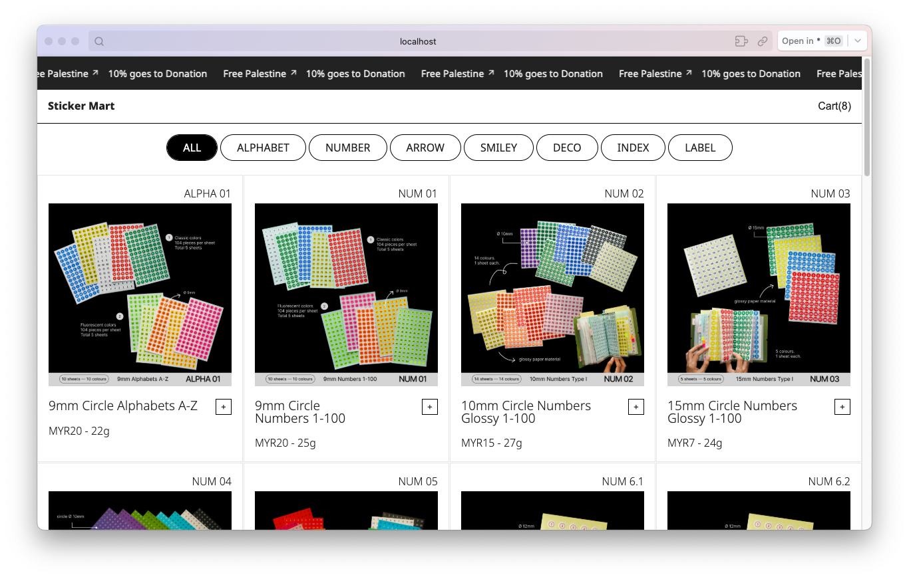
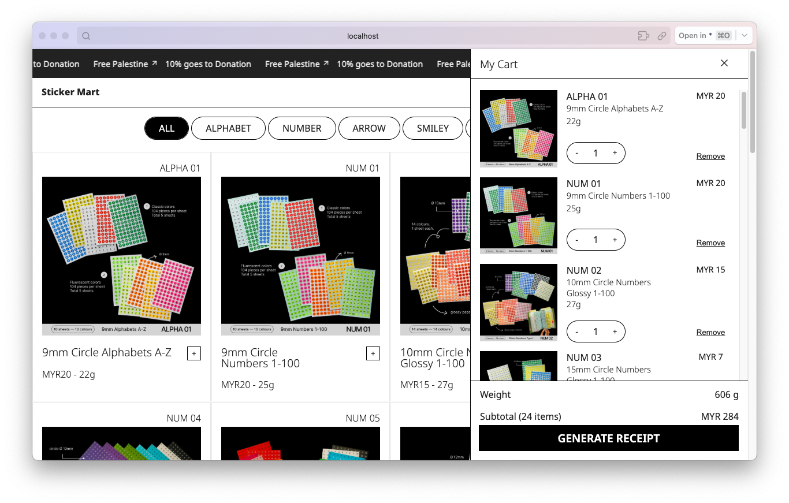
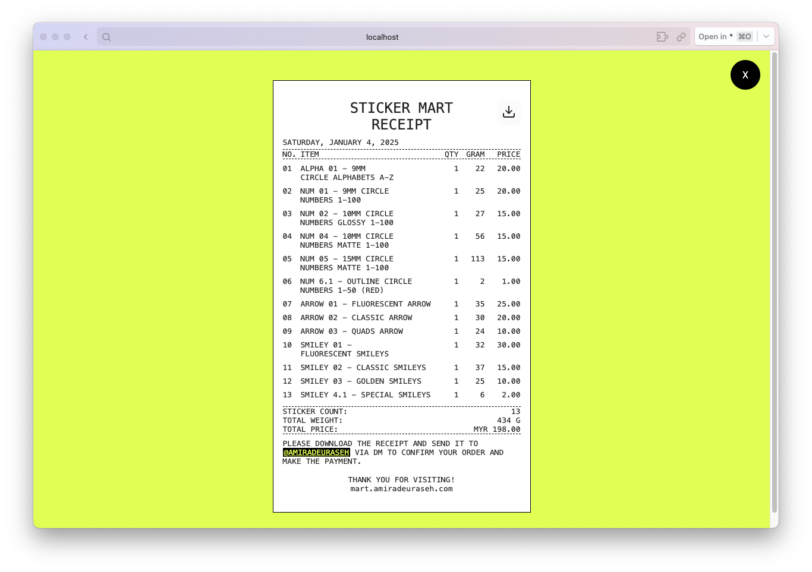

# Mart

Sticker Mart — a fun product gallery ☺︎

## How it started

Stem from my ~~obsession~~ love with collecting tiny cuties for journaling. I wanted to offer a unique web experience to browsing the product catalogue.

## Technologies

-   [React](https://react.dev/): Javacript framework
-   [React Router](https://reactrouter.com/) : Routing multiple pages
-   [Framer Motion](https://motion.dev/): Animating components
-   [Lenis](https://lenis.darkroom.engineering/): Smooth scroll
-   [styled-component](https://styled-components.com/): Styling components
-   [Vite](https://vite.dev/): Package build tools
-   [React Feather](https://github.com/feathericons/react-feather) : Icons library
-   [react-focus-lock](https://github.com/theKashey/react-focus-lock): Accessibility
-   [react-remove-scroll](https://github.com/theKashey/react-remove-scroll): Remove scroll bar
-   [react-wrap-balancer](https://github.com/shuding/react-wrap-balancer): Text wrapping for better title readability

## Version 1 Look

Home Page: product gallery

Aside Slider: manage cart

Checkout Page: view order

